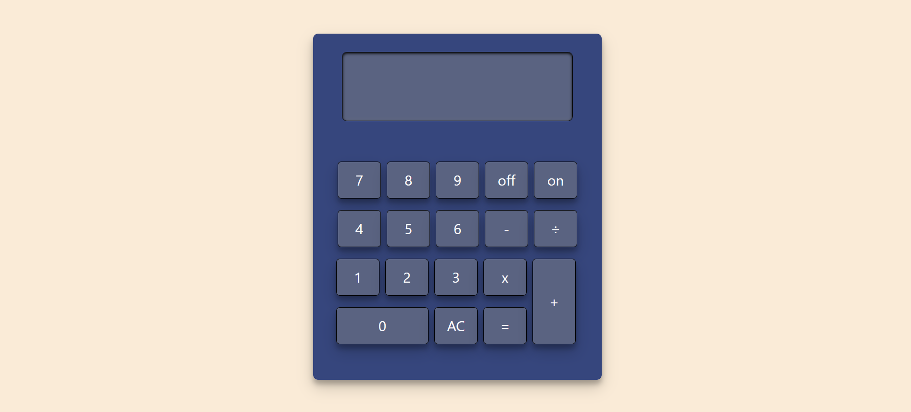

 &nbsp&nbsp&nbsp

# Calculadora

Proyecto realizado en vanilla JS que simula el comportamiento de una calculadora de bolsillo.

Para los estilos se ha empleado CSS.

## Capturas

## Despliegue

Puedes ver el despliegue [aquí](https://sorayaleon.github.io/calculadora/)